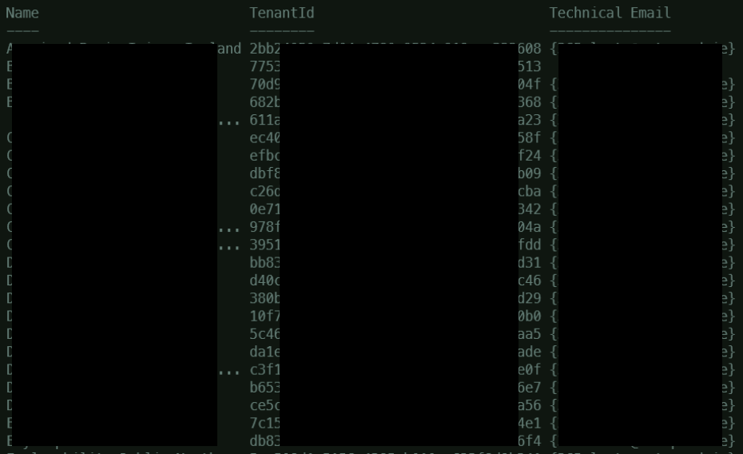

# MSPartner

## `PartnerOverview.ps1` contains two functions:
-   `Get-TechnicalNotificationEmails`
-   `Set-TechnicalNotificationEmails`

>To run these functions you need to connect to MSOnline (`Connect-MsolService`) and sign in with and account with Partner Center permissions.

`Get-TechnicalNotificationEmails` will list the Name, Tenant Id and Technical Email information for all Customers.

`Set-TechnicalNotificationEmails` will change the email address for technical notifications for **ALL** of your customers. Use `-TechnicalEmail` parameter to specify the email address.